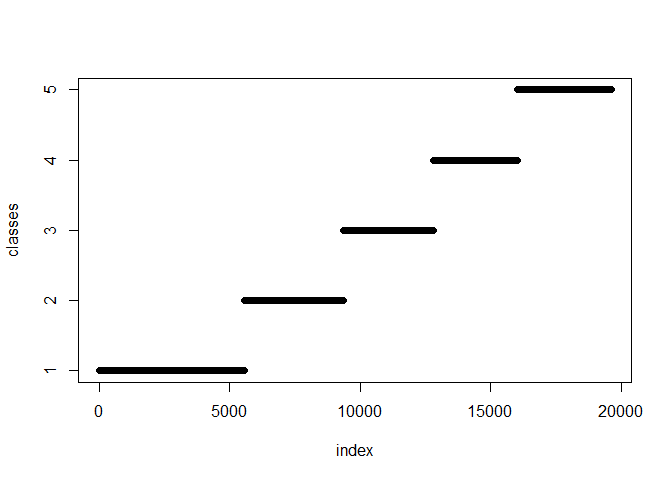

# Predicting Correct Barbell Lift form via Devices
Nirave Kadakia  

### Executive Summary
Using data from devices such as Jawbone UP, Nike FuelBand, and Fitbit, it is possible to predict whether a barbell life was done correctly.  

Using data from accelerometers on the belt, forearm, arm, and dumbell of 6 participants. They were asked to perform barbell lifts correctly and incorrectly in 5 different ways. With this information, it is possible to determine how a barbell lift was done.

All information and data and the types of lifts can be found here: http://groupware.les.inf.puc-rio.br/har

In short, the types of barbell lifts, that will be predicted for, are as follows:

* Class A - Exactly according to the specification
* Class B - Throwing the elbows to the front
* Class C - Lifting the dumbbell only halfway
* Class D - Lowering the dumbbell only halfway
* Class E - Throwing the hips to the front

## The Training and Testing Set


```r
#Load the testing and training data
trainingLoaded <- read.csv("https://d396qusza40orc.cloudfront.net/predmachlearn/pml-training.csv", na.strings=c("NA","#DIV/0!",""))
testing <- read.csv("https://d396qusza40orc.cloudfront.net/predmachlearn/pml-testing.csv", na.strings=c("NA","#DIV/0!",""))
```

## Variable selection

It is important to see how the data is presented to make sure that each class is adequetely represented and to look for any patterns.  While there are over 160 variables, it would be difficult to look for all, but it is good to make sure if there are any patterns.


```r
classes <- trainingLoaded$classe
index <- seq(1, length(trainingLoaded$classe))
plot(index, classes)
```

\

It seems like the list is ordered in a particular way.  It is important to ensure that the order is not included, as this is an artificila construct.  In addition, it is important to remove various other variables that are not relevant, like the user name.

Finally, to fit into machine learning, it is important to remove columns that have NA, as that is incompatible with our maching learning choices.


```r
#Remove identifying variables that are not quantative and have no bearing
trainingAll <- trainingLoaded
trainingAll$user_name <- NULL
trainingAll$cvtd_timestamp<-NULL
trainingAll$new_window<- NULL
trainingAll$X <- NULL

#Remove columns that contain NA, as it is not reliable for machine learning
trainingAll <- trainingAll[ , colSums(is.na(trainingAll)) == 0]

library(caret)
set.seed(59)
```
### Cross Validation - Creating a training and validation set

To perform cross validation, it is important to splice out a validation testing set.  Since there are over 19622 rows in the training set, simple data splitting will suffice.  In this case, the partition is 20% of the training set.


```r
#Separate out the training into a training and a validation section
inTrain <- createDataPartition(trainingAll$classe, p = 0.80)[[1]]
training <- trainingAll[ inTrain,]
validation <- trainingAll[-inTrain,]
```

## Random Forest

With a random forest, performing PCA is not necessary, so the variable cleanup perfomed above should be sufficient.

Random Forest was chosen because it is fast.  Other methods like gbm and glm proved too long to run.


```r
library(randomForest)
randForest <- randomForest(classe ~ ., training, method="class")

randForestPrediction <- predict(randForest, validation, type="class")
```

### Out of Sample Error

Cross validation against a chunk of the data set, it yields very high accuracy of over 99%.   


```r
confusionMatrix(randForestPrediction, validation$classe)$overall['Accuracy']
```

```
##  Accuracy 
## 0.9984706
```

## Decision Tree


Another fast method is the decision tree.  Since decision trees are also relatively accurate, it makes sense to try it out.


```r
library(rpart)
library(rpart.plot)

decTree <- rpart(classe ~ ., training, method="class")
decTreePrediction <- predict(decTree, validation, type="class")
```

### Out of Sample Error

Cross validation against a chunk of the data set, it yields a lower accuracy level, and should thus be ignored.  


```r
confusionMatrix(decTreePrediction, validation$classe)$overall['Accuracy']
```

```
##  Accuracy 
## 0.8271731
```

### Against the Test data

Since the random forest produces a very high accuracy rate, performing extra machine learning or combining predictors would not prove that beneficial compared to the extra computational time it would take.  So, the random forest model will be used to predict against the test set:


```r
testingPredict<-predict(randForest, testing, type="class")

print(testingPredict)
```

```
##  1  2  3  4  5  6  7  8  9 10 11 12 13 14 15 16 17 18 19 20 
##  B  A  B  A  A  E  D  B  A  A  B  C  B  A  E  E  A  B  B  B 
## Levels: A B C D E
```


### Conclusion

In summary, acceleramoters on devices can provide high level or accuracy in determining whether an individual can perform a barbell life correctly.  If not, it can also tell the individual how they performed the barbell lift incorrectly.
